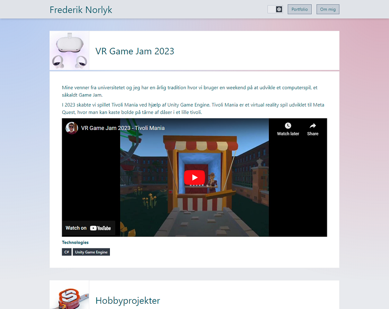

# svelte-portfolio

Configurable portfolio built using SvelteKit and TypeScript.



### Technologies

- SvelteKit
- TypeScript
- PostgreSQL
- Skeleton UI
- Tailwind CSS

### Try it out 🚀

I'm hosting it here on Vercel: [svelte-portfolio-frederik-norlyk.vercel.app](https://svelte-portfolio-frederik-norlyk.vercel.app/).

### Installation

If you want to run it yourself you can follow these instructions.

To link the application with your Vercel PostgreSQL database, run this command
([Read more](https://vercel.com/docs/cli)):

```bash
npx vercel link
```

Then create an `.env` file by running:

```bash
npx vercel env pull .env
```

### Environment variables

The following environment variables are need.

```
PUBLIC_USERNAME=Your name
PUBLIC_CONTACT=www.linkedIn.com/you
PUBLIC_ABOUT="My name is..."
```
